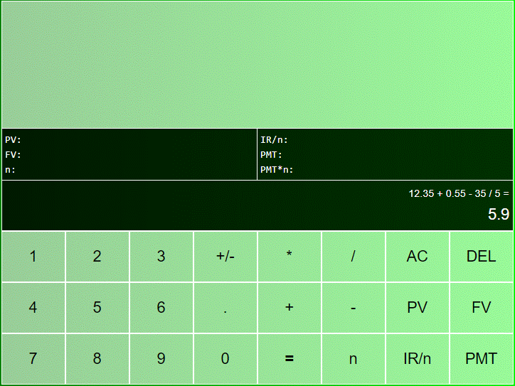
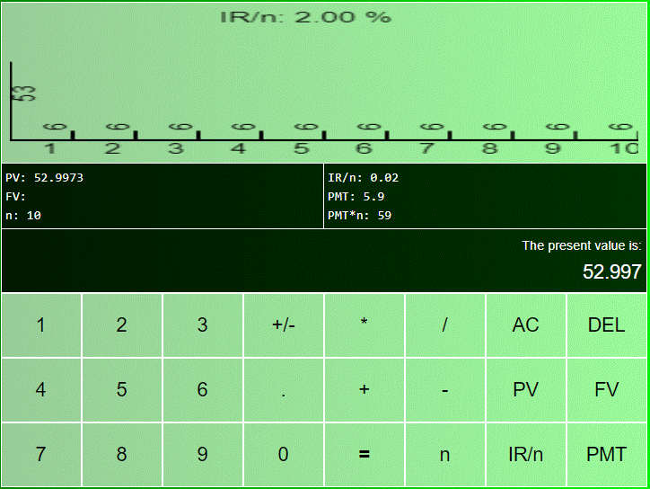
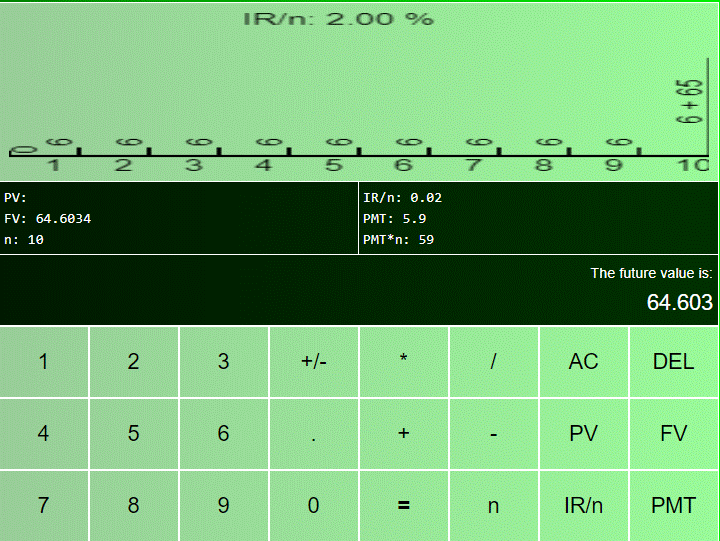
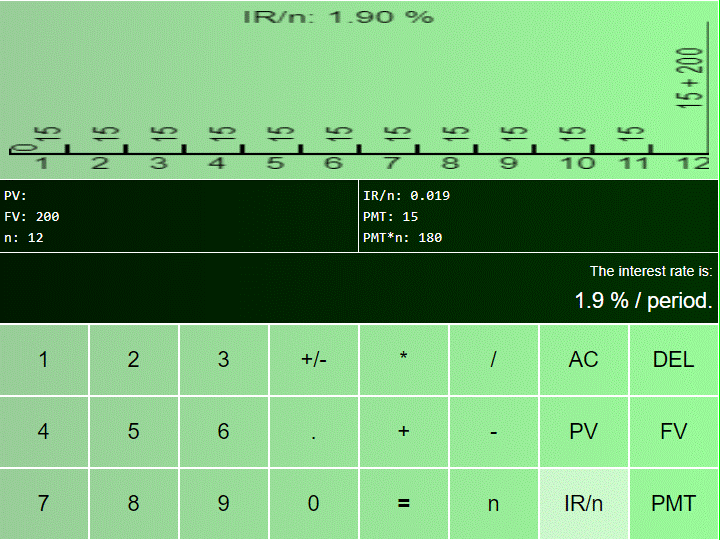
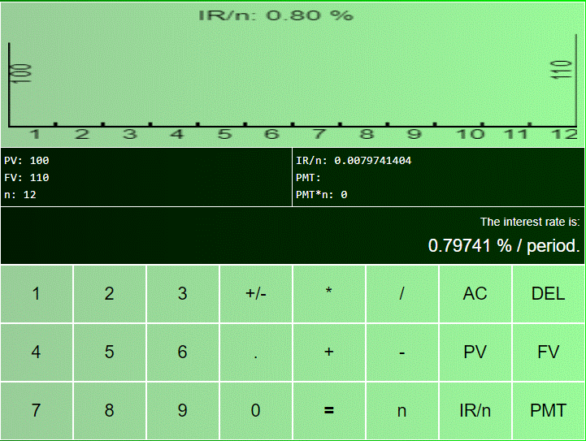
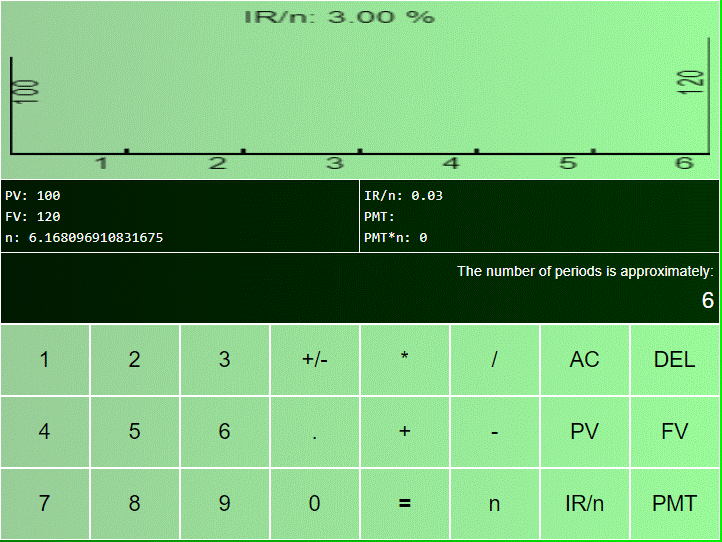
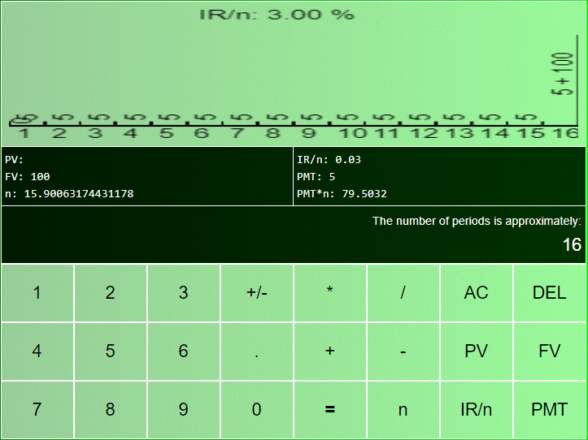

# **Calculadora Financeira**

  
# Acerca de
> Una calculadora financiera desarrollada en html-css-js que contiene los operadores matemáticos básicos y los operadores financieros (PV, FV, PMT, I, N), también contiene un gráfico que traza la operación actual.  
>  
>  
>    

# Aspectos
> - El proyecto de calculadora financiera contiene principalmente los operadores financieros PV: valor presente, FV: valor futuro: PMT: tiempo de pago por mes (en realidad cualquier período de tiempo igual y constante), N: número de períodos e IR/n: tasa de interés por periodo de tiempo.
> - Este proyecto también tiene las siguientes operaciones básicas: +, -, *, /, +/-, que se pueden utilizar en cualquier momento.
> - Este proyecto está construido en html-css-js.
> - El panel central muestra una expresión infija formada al ingresar números y operadores básicos y también los valores de la operación financiera.
> - En la parte superior de la aplicación, se muestra un gráfico donde se traza la operación actual.  

# Diseños
> ## Estado inicial
> 

> ## Usar como una calculadora matemática básica.
> 

> ## Establezca el resultado obtenido anteriormente como un valor de PMT
> 

> ## Ingrese 10 meses de pagos o años o cualquier otro período de tiempo constante.
> 

> ## Ingrese una tasa de interés por período
> Tenga en cuenta que si la tasa de interés se establece en más de uno, se considerará como un porcentaje.  
> 

> ## Obtenga, por ejemplo, el valor actual (PV) presionando PV
> 

> Haga doble clic en el PV (o en cualquier otro botón de finanzas) para restablecerlo.  
> ## Luego calcule el valor futuro presionando FV
> 

> ## También puedes calcular la tasa de interés para una situación dada
> 
> o para otra situación  
> 
> o por una otra mas  
> 

> ## También puede calcular aproximadamente el número de períodos para una situación dada
> 
> o para otra situación  
> 
> o para una mas  
> 

> ## Y finalmente, tenga en cuenta que si N es demasiado grande, el gráfico indica sintéticamente los valores de PMT y N
> 

# Tecnologies
> - HTML, CSS y Javascript  

# Ejecutando
> - Ejecutar en cualquier navegador o servidor.  7

# Autor
> Pedro Vitor Abreu
>
> <soft.pva@gmail.com>
>
> <https://github.com/softpva>