# **Calculadora Financeira**

  
# Sobre
> Uma calculadora financeira desenvolvida em html-css-js que contém os operadores matemáticos básicos e operadores financeiros (PV, FV, PMT, I, N), também contém um gráfico que plota a operação em curso.  
>  
>  
>   

# Aspectos
> - O projeto de calculadora financeira contém, principalmente, os operadores financeiros PV: valor presente, FV: valor futuro: PMT: tempo de pagamento por mês (na verdade, qualquer período de tempo igual e constante), N: número de períodos e IR/n: taxa de juros por período de tempo .
> - Este projeto também possui as seguintes operações básicas: +, -, *, /, +/-, que podem ser usadas a qualquer momento.
> - Este projeto é construído em html-css-js.
> - O painel médio mostra uma expressão infixa formada pela inserção de números e operadores básicos e também os valores da operação fianceira.
> - Na parte superior do aplicativo, é mostrado um gráfico onde a operação atual é plotada.  

# Layouts
> ## Estado inicial
> 

> ## Usando como uma simples calculadora matemática
> 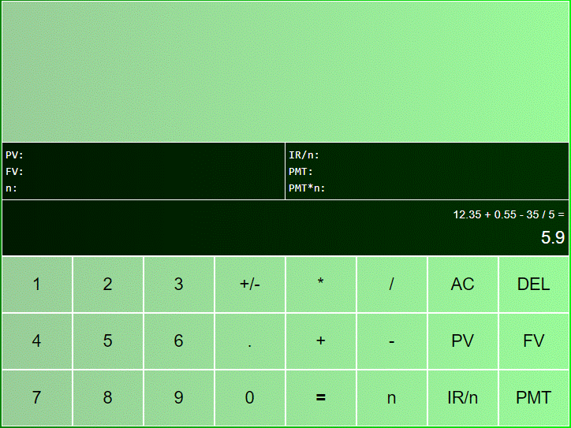

> ## Defina o resultado obtido acima como um valor PMT
> 

> ## Insira 10 meses de pagamentos ou anos ou qualquer outro período de tempo constante.
> 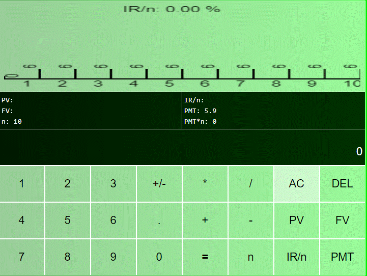

> ## Insira uma taxa de juros por período
> Observe que, se a taxa de juros for definida como maior que um, será considerada como uma porcentagem.  
> 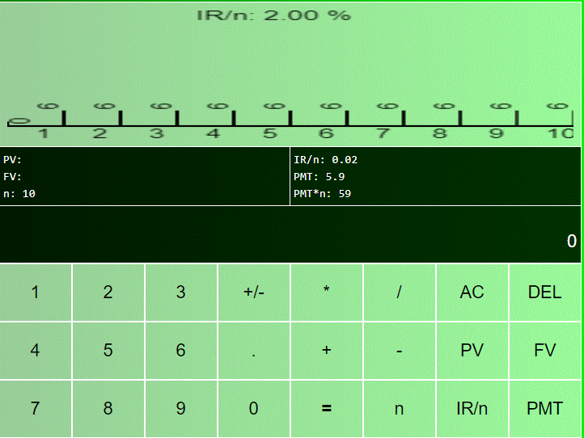  

> ## Obtenha, por exemplo, o Valor Presente (PV) pressionando PV
> 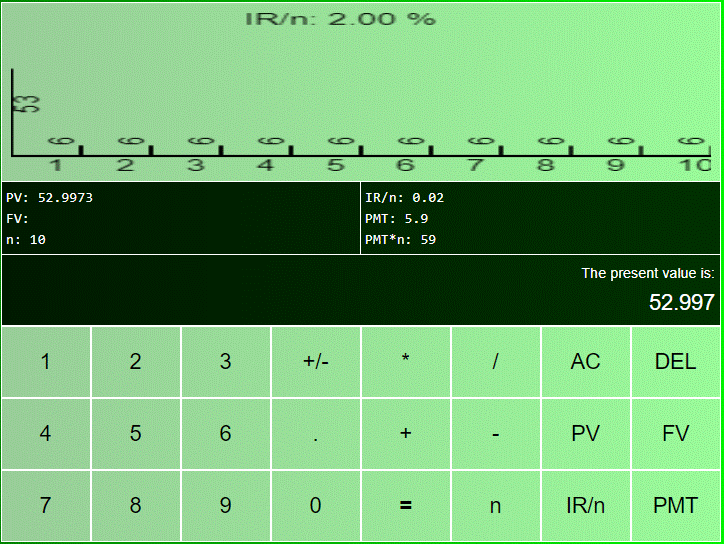

> Clique duas vezes no PV (ou qualquer outro botão financeiro) para zerá-lo.  
> ## Depois calcule o Valor Futuro, pressionando FV
> 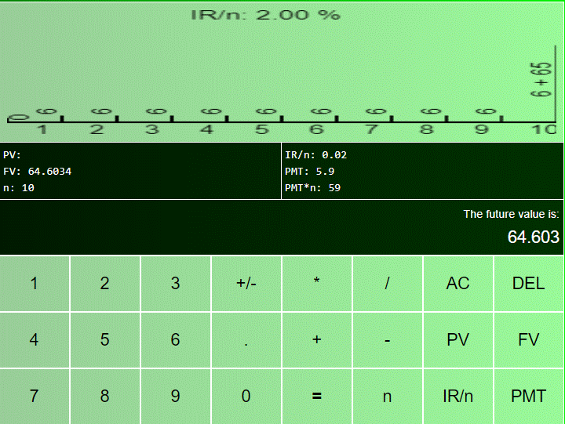

> ## Você também pode calcular a taxa de juros para uma determinada situação
> 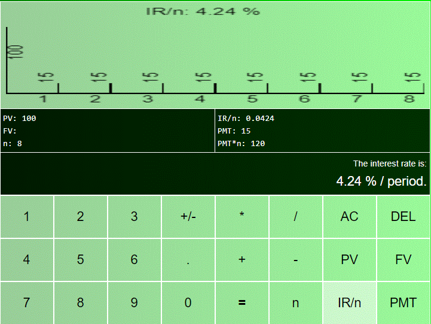
> ou para outra situação  
> 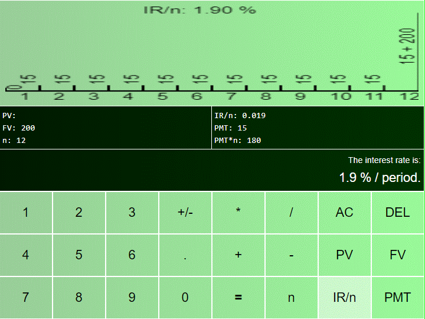
> ou para mais uma  
> 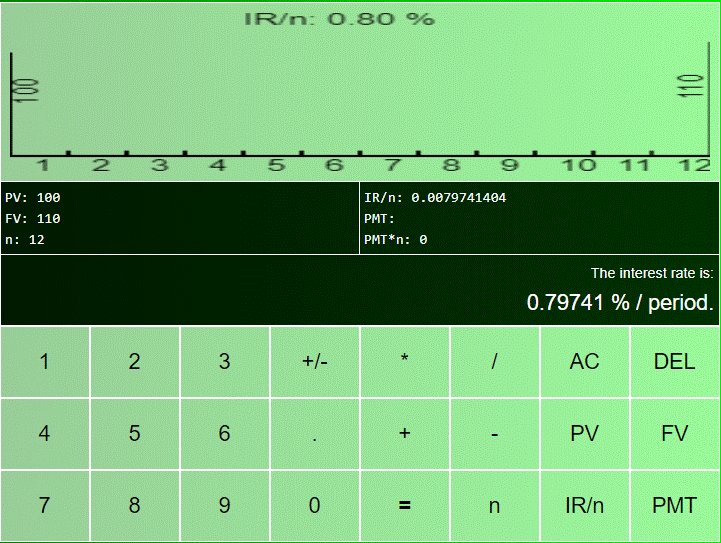

> ## Você também pode calcular aproximadamente o número de períodos para uma determinada situação
> 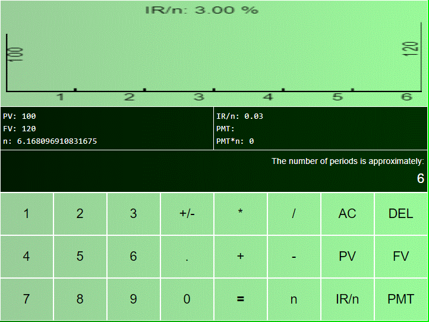
> ou para outra situação  
> 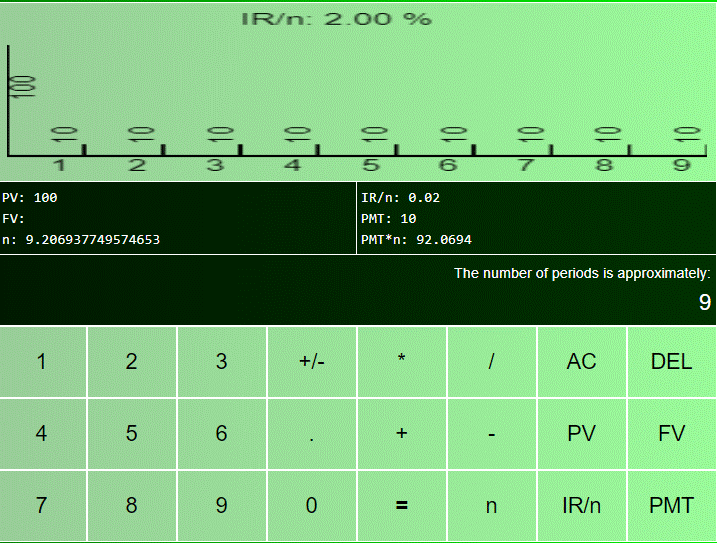
> ou para mais uma  
> 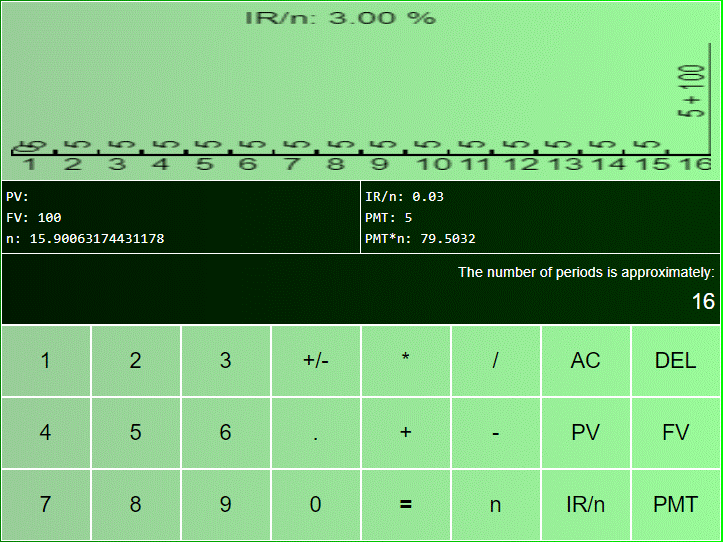

> ## E, por fim, observe que se N é muito grande, o gráfico indica sinteticamente os valores de PMT e N
> 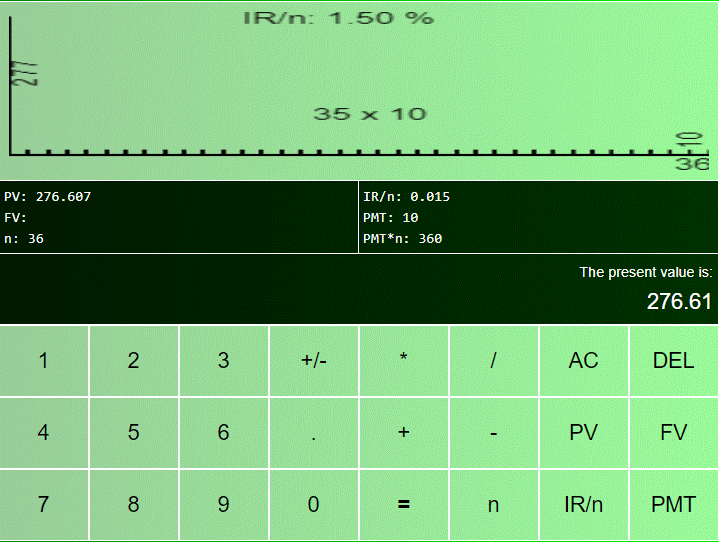

# Tecnologies
> - HTML, CSS e Javascript  

# Rodando
> - Rode em qualquer navegador ou servidor.

# Autor
> Pedro Vitor Abreu
>
> <soft.pva@gmail.com>
>
> <https://github.com/softpva>
