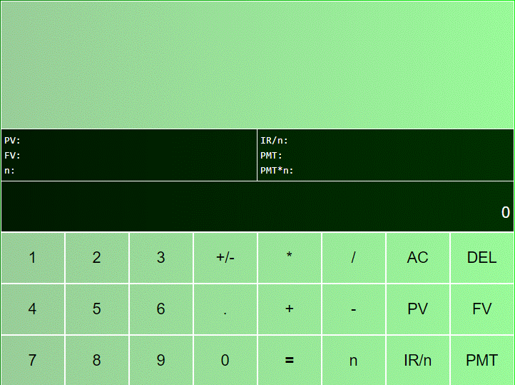
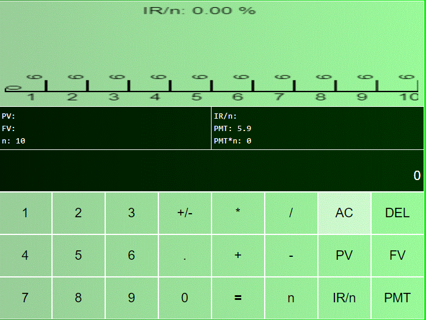
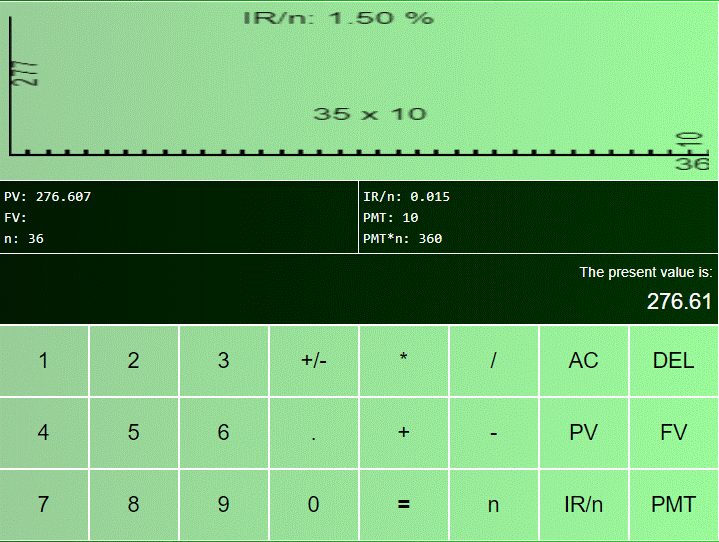

# **Financial Calculator**

  
# About
> A financial calculator developed in html-css-js that contains the basic math operators and financial operators (PV, FV, PMT, I, N), it also contains a graph that plot the operation on course.   
>  
>  
>   

# Features
> - The financial calculator project mainly contains financial operators PV: Present Value, FV: Future Value: PMT: Pay Time Per Month (actually any equal and constant time period), N: Number of Periods, and IR/n: Interest Rate by Time Period.
> - This project also has the follow basics oprations: +, -, *, /, +/-, that can use at any time.
> - This project is built in html-css-js.
> - The middle panel shows an infix expression formed by entering numbers and basic operators and also the financial operation values.
> - At the top of the application, a graph is shown where the current operation is plotted.

# Layouts
> ## Initial state
>   

> ## Using as a basic math calculator  
>  

> ## Set the result obtained above to a PMT value 
>  

> ## Input 10 months of payments or years or any other constant period of time  
>  

> ## Input an interest rate by period
> Note, if interest rate will be set greater than one, it'll be considered a percentage.  
>  

> ## Get the Present Value (PV), for example, pressing PV
>   

> Double click in PV (or any other financial button) to reset it.  
> ## Than calculate the Future Value, pressing FV
>  

> ## You can also calculate the interest rate for a given situation
>   
> or for another situation  
>   
> or for yet another one  
> 

> ## You can also calculate approximately the number of periods for a given situation
>    
> or for another situation
>   
> or for yet another one  
>   

> ## And, finally, observe if N is too large, the graph synthetically indicates the values of PMT and N
>  

# Tecnologies
> - HTML, CSS and Javascript

# Kick off
> - Run in any browser or server.

# Author
> Pedro Vitor Abreu
>
> <soft.pva@gmail.com>
>
> <https://github.com/softpva>

